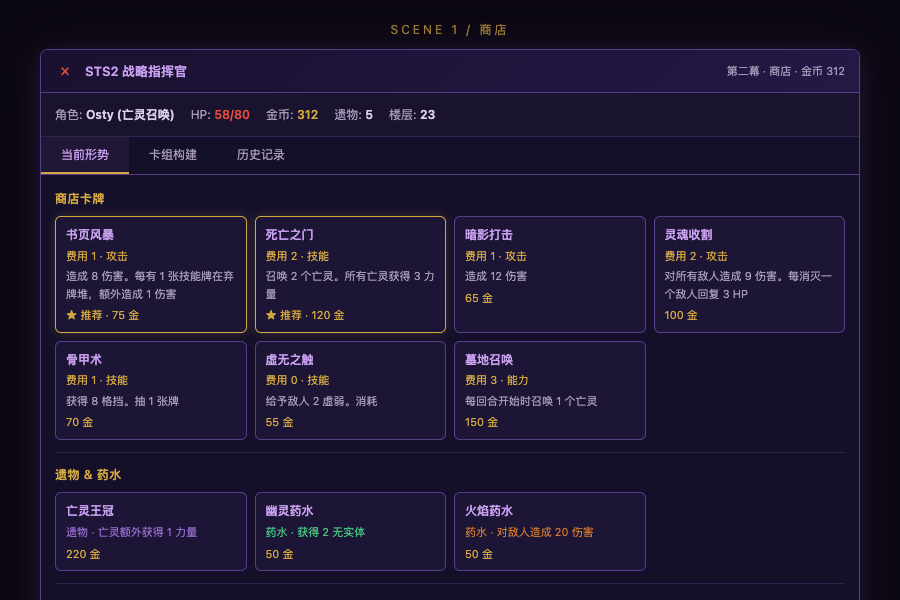
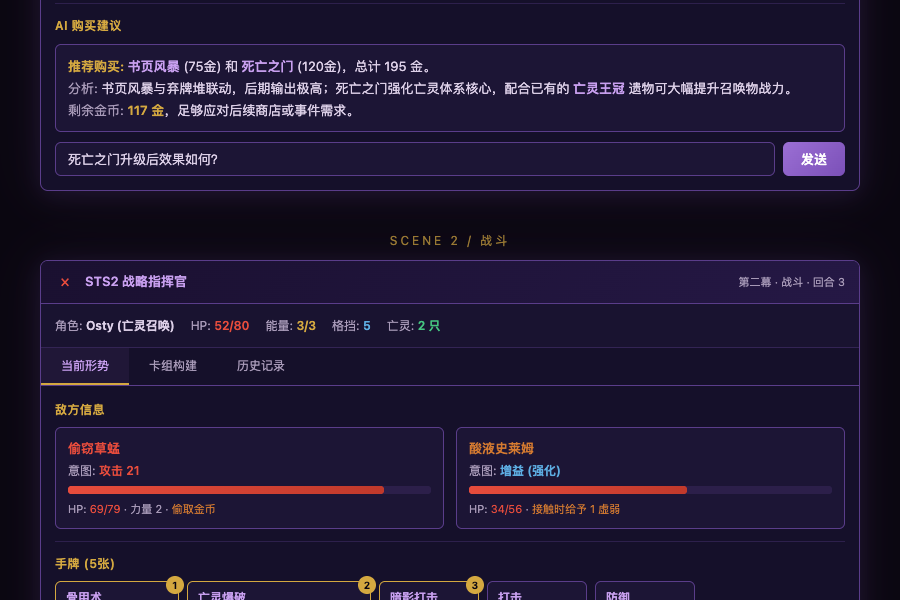
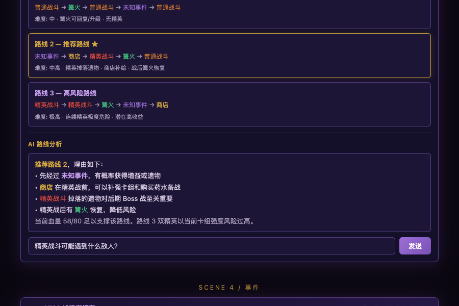
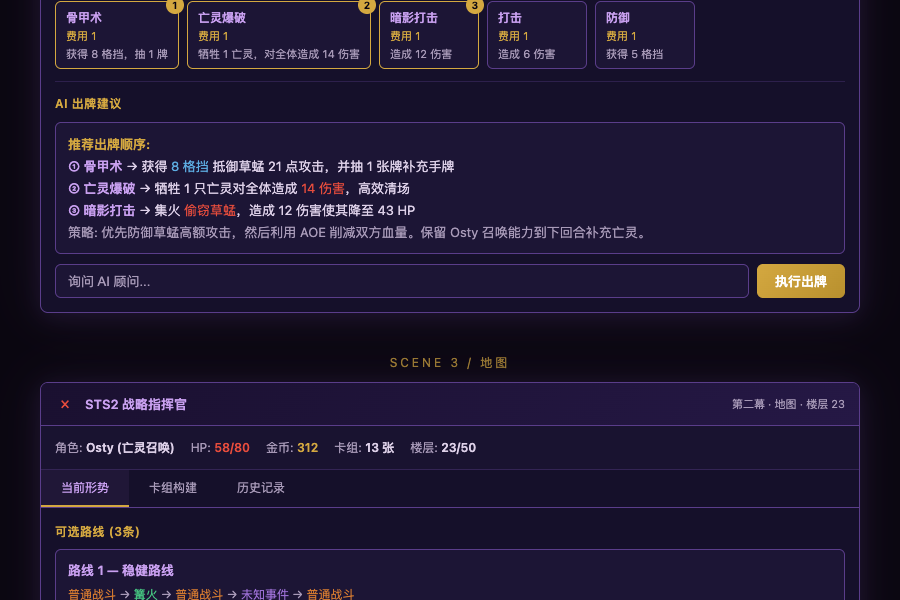

# STS2 Commander — Slay the Spire 2 战略指挥官

A real-time strategy commander for Slay the Spire 2: offline simulator, AI-powered overlay, knowledge base, learning system, and MCP bridge.

杀戮尖塔2 实时战略指挥官：离线模拟器、AI 驱动的 Overlay、知识库、学习系统、MCP 桥接。

---

## Overlay UI / 界面预览

Royal Purple theme — the overlay covers every in-game scene with real-time AI advice.

皇室紫主题 — Overlay 覆盖所有游戏场景，提供实时 AI 策略建议。

<div align="center">

<br><sub>▲ Combat — 战斗分析 + 出牌建议</sub>
<br><br>

<br><sub>▲ Elite Combat — 精英战威胁评估</sub>
<br><br>

<br><sub>▲ Map & Route Analysis — 地图路线 AI 推荐</sub>
<br><br>

<br><sub>▲ Event & Shop — 事件最优选择分析</sub>
</div>

<br>

> 12 scene types covered. Clone the repo and open any HTML in [`tests/reference/`](tests/reference/) to preview the full interactive UI.
>
> 覆盖 12 种场景。克隆仓库后打开 [`tests/reference/`](tests/reference/) 下的 HTML 即可预览完整交互 UI。

---

## Features / 功能一览

| Feature | Description | 功能 | 说明 |
|---------|-------------|------|------|
| Offline Simulator | Zero-token, pure-Python battle simulation + full 3-act run | 离线模拟器 | 0 token 消耗，纯 Python 战斗模拟 + 三幕全流程 |
| Online Overlay | CustomTkinter UI with real-time in-game advice | 在线 Overlay | CustomTkinter UI，实时对局建议 |
| Knowledge Base | 10 JSON files covering cards, monsters, bosses, events, relics | 知识库 | 10 个 JSON 文件，覆盖卡牌、怪物、Boss、事件、遗物 |
| Learning System | Replay analysis → trend detection → experience extraction | 学习系统 | 对局回放 → 趋势分析 → 经验提炼 |
| MCP Bridge | Connect to the live game via the STS2MCP mod | MCP 桥接 | 通过 STS2MCP mod 连接游戏进程 |

---

## Directory Structure / 目录结构

```
sts2-commander/
├── data/                   Raw data (extracted from source) / 原始数据
│   ├── cards/              577 cards / 577 张卡牌
│   ├── monsters/           121 monsters / 121 个怪物
│   ├── relics/             290 relics + 64 potions / 290 遗物 + 64 药水
│   └── meta/               Ascension rules, epoch unlocks / 进阶规则、纪元解锁
│
├── knowledge/              Knowledge base (~850 KB, 10 files) / 知识库
│   ├── archetype_matrix.json   5 characters × 35 archetypes / 5 角色 × 35 流派
│   ├── monster_ai.json         76 monster AI patterns / 76 怪物 AI + 招式模式
│   ├── card_tier_list.json     Card tier list (S/A/B/C/D) / 全卡分级
│   ├── boss_counter_guide.json 8 boss matchup strategies / 8 Boss 对阵打法
│   ├── card_synergy_index.json Card synergy index / 牌间协同关系
│   ├── event_guide.json        66 event optimal choices / 66 事件最优选择
│   ├── potion_guide.json       63 potions / 63 种药水
│   ├── relic_pivot_rules.json  Relic pivot rules / 遗物转型规则
│   ├── combat_rules.json       Combat calculation rules / 战斗计算规则
│   └── lessons.json            Learning records / 学习记录
│
├── simulator/              Offline simulator / 离线模拟器
│   ├── entities.py         Card / Player / Enemy / Buff
│   ├── data_loader.py      Data loader / 数据加载
│   ├── combat.py           Combat engine + card-play AI / 战斗引擎 + 出牌 AI
│   ├── archetypes.py       35 archetype presets / 35 流派预设牌组
│   ├── deckbuilder.py      Card pick / shop / event AI / 选牌、商店、事件 AI
│   └── full_run.py         Full 3-act run simulation / 三幕全流程模拟
│
├── overlay/                Online overlay (CustomTkinter)
│   ├── commander.py        Main class: UI + polling + dispatch
│   ├── constants.py        Translation dicts, colors, config / 翻译字典、颜色、配置
│   ├── display.py          UI display methods / UI 显示方法
│   ├── ai_advisor.py       LLM calls + strategy prompts / LLM 调用 + 策略 prompt
│   ├── history.py          Logging, replay, post-game analysis / 日志、回放、复盘
│   ├── data.py             Data loading, saves, sessions / 数据加载、存档、session
│   └── launch.sh           Launch script / 启动脚本
│
├── scripts/                Utility scripts / 脚本工具
├── tests/                  Tests + UI references / 测试 + UI 参考
│   ├── reference/          Per-scene UI mockups (HTML) / 各场景 UI 设计稿
│   └── themes/             Color theme explorations / 配色方案探索
├── replays/                Game replays (gitignored) / 对局回放
└── runtime/                Runtime data (gitignored) / 运行时数据
```

---

## Quick Start / 快速开始

### Requirements / 环境要求

- Python 3.12+
- No additional dependencies (the simulator is pure Python)
- 无额外依赖（模拟器为纯 Python）

### Offline Simulator / 离线模拟器

```bash
# Archetype battle test — 35 archetypes × 200 runs
# 预设牌组战斗测试 — 35 流派 × 200 局
python -m simulator 200

# Full 3-act run — includes card picks, shop, events, rest sites
# 三幕全流程模拟 — 含选牌、商店、事件、休息
python -m simulator --full 100

# High ascension test / 高进阶测试
python -m simulator --full 100 --asc 10
```

### Python API

```python
from simulator.full_run import batch_simulate, simulate_full_run

# Archetype battle test / 预设牌组战斗测试
r = batch_simulate("铁甲战士", "力量流", runs=200, asc=10)
print(f"Win rate / 胜率: {r['winrate']*100:.1f}%")

# Single full run / 单局全流程
r = simulate_full_run("缺陷体", asc=5)
print(f"{'Win' if r['won'] else 'Loss'}, reached floor {r['floor_reached']}")
```

### Learning System / 学习系统

```bash
# Simulate + learn: batch simulate and auto-extract lessons
# 模拟+学习：批量模拟并自动提炼经验
python scripts/learning_system.py simulate -c "铁甲战士" -n 15 -a 5

# Check status / 查看状态
python scripts/learning_system.py status

# Review / Trends / Learn — 复盘 / 趋势 / 提炼
python scripts/learning_system.py review
python scripts/learning_system.py trends
python scripts/learning_system.py learn
```

### Online Overlay / 在线 Overlay

```bash
./overlay/launch.sh
```

Requires the STS2MCP mod to be installed and the game to be running.
需要安装 STS2MCP mod 并启动游戏。

---

## Simulation Results / 模拟效果

### Full-Run Win Rates (3-act clear, 200 runs per archetype) / 全流程胜率

| Archetype / 流派 | A0 | A5 | A10 |
|-------------------|-----|-----|------|
| Ironclad / 铁甲战士 — Exhaust / 消耗流 | 100% | 100% | 100% |
| Ironclad / 铁甲战士 — Combo / 连击流 | 100% | 100% | 100% |
| Ironclad / 铁甲战士 — Block Slam / 格挡撞击流 | 100% | 100% | 99.5% |
| Ironclad / 铁甲战士 — Feed Heal / 喂食回血流 | 100% | 100% | 99.0% |
| Ironclad / 铁甲战士 — Self-Harm / 自伤流 | 100% | 99.5% | 97.5% |
| Ironclad / 铁甲战士 — Strike / 打击流 | 100% | 100% | 91.5% |
| Ironclad / 铁甲战士 — Strength / 力量流 | 100% | 99.0% | 83.0% |
| Silent / 静默猎手 — Discard / 弃牌流 | 100% | 100% | 100% |
| Silent / 静默猎手 — Agility Block / 敏捷格挡流 | 100% | 100% | 100% |
| Silent / 静默猎手 — Assassination / 暗杀流 | 100% | 100% | 100% |
| Silent / 静默猎手 — Ghost Guard / 幽灵防御流 | 100% | 100% | 100% |
| Silent / 静默猎手 — 0-Cost Rush / 0费速攻流 | 100% | 100% | 100% |
| Silent / 静默猎手 — Shiv / 飞刀流 | 100% | 100% | 99.5% |
| Silent / 静默猎手 — Poison / 毒素流 | 100% | 100% | 98.5% |
| Defect / 缺陷体 — Focus All-Round / 集中全能流 | 100% | 100% | 100% |
| Defect / 缺陷体 — Lightning / 闪电流 | 100% | 100% | 100% |
| Defect / 缺陷体 — Dark Orb Burst / 暗球爆发流 | 100% | 100% | 100% |
| Defect / 缺陷体 — 0-Cost Claw / 0费爪击流 | 100% | 100% | 100% |
| Defect / 缺陷体 — Frost Shield / 冰霜护盾流 | 100% | 100% | 100% |
| Defect / 缺陷体 — Energy Cycle / 能量循环流 | 100% | 100% | 99.5% |
| Defect / 缺陷体 — Overload Burst / 超载爆发流 | 100% | 100% | 98.5% |
| Heir / 储君 — 0-Cost Rush / 0费速攻流 | 100% | 100% | 100% |
| Heir / 储君 — Particle Defense / 粒子防御流 | 100% | 100% | 100% |
| Heir / 储君 — Heavy Strike / 重击流 | 100% | 100% | 99.5% |
| Heir / 储君 — Astral Control / 星辰控制流 | 100% | 100% | 98.5% |
| Heir / 储君 — Void Form / 虚空形态流 | 100% | 100% | 98.0% |
| Heir / 储君 — Colorless Gen / 无色生成流 | 100% | 100% | 92.0% |
| Heir / 储君 — Forge Warrior / 铸造战士流 | 100% | 100% | 90.5% |
| Necrobinder / 亡灵契约师 — Soul Void / 灵魂虚无流 | 100% | 100% | 99.0% |
| Necrobinder / 亡灵契约师 — High-Cost Execute / 高费斩杀流 | 100% | 100% | 99.0% |
| Necrobinder / 亡灵契约师 — Fear Debuff / 恐惧削弱流 | 100% | 100% | 98.0% |
| Necrobinder / 亡灵契约师 — Osty + Doom Hybrid / Osty+灾厄混合流 | 100% | 100% | 96.5% |
| Necrobinder / 亡灵契约师 — Osty Summon / Osty召唤流 | 100% | 99.5% | 95.5% |
| Necrobinder / 亡灵契约师 — Graveyard Recycle / 墓地回收流 | 100% | 100% | 94.0% |
| Necrobinder / 亡灵契约师 — Doom / 灾厄流 | 100% | 100% | 91.0% |

> **A10 average win rate across all archetypes: 97.7%**
>
> **A10 全流派平均胜率：97.7%**

### Character Strength (A10 Average) / 角色强度

| Character / 角色 | A10 Avg Win Rate / A10 平均胜率 |
|-------------------|-------------------------------|
| Defect / 缺陷体 | 99.8% |
| Silent / 静默猎手 | 99.7% |
| Heir / 储君 | 96.9% |
| Necrobinder / 亡灵契约师 | 96.1% |
| Ironclad / 铁甲战士 | 95.8% |

---

## Game Version / 游戏版本

Data is based on Slay the Spire 2 EA (Early Access). All data was extracted from decompiled source code, not from STS1.

数据基于 Slay the Spire 2 EA（Early Access）。所有数据从反编译源码提取，非 STS1。

**STS2 ≠ STS1**: Card pools, monsters, relics, and mechanics are all different. For example, Accelerant triggers extra poison damage instead of doubling it; Rupture only triggers on self-damage.

**STS2 ≠ STS1**：卡牌池、怪物、遗物、机制均不同。Accelerant（触媒）触发额外毒伤而非翻倍，Rupture 仅在自伤时触发。

---

## License / 许可证

MIT
